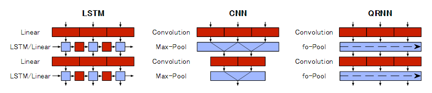
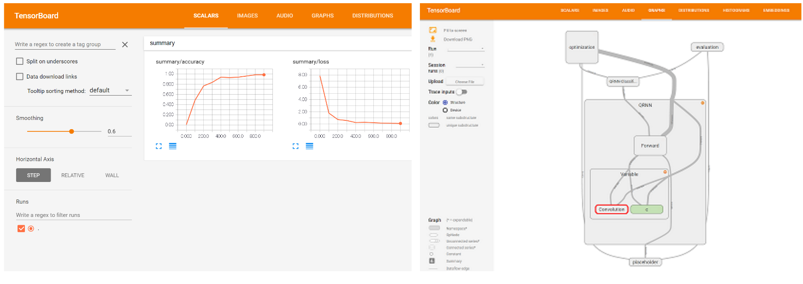

# Tensorflow QRNN

QRNN implementation for TensorFlow. Implementation refer to below blog.

[New neural network building block allows faster and more accurate text understanding](http://metamind.io/research/new-neural-network-building-block-allows-faster-and-more-accurate-text-understanding/)



## Dependencies

* TensorFlow: 0.12.0rc0
* scikit-learn: 0.18.1 (for working check)

## How to run

**Forward Test**

To confirm forward propagation, run below script.

```
python test_tf_qrnn_forward.py
```

**Working Check**

To confirm the performance of QRNN compare with baseline(LSTM), run below script.
Dataset is [scikit-learn's digit dataset](http://scikit-learn.org/stable/auto_examples/datasets/plot_digits_last_image.html).


```
python test_tf_qrnn_work.py
```

You can check the calculation result by [TensorBoard](https://www.tensorflow.org/versions/r0.12/how_tos/summaries_and_tensorboard/index.html).



For example.

```
tensorboard --logdir=./summary/qrnn
```

## Experiments

```
Baseline(LSTM) Working check
Iter 0: loss=2.498406410217285, accuracy=0.1640625
Iter 100: loss=0.3690841495990753, accuracy=0.890625
Iter 200: loss=0.10620299726724625, accuracy=0.953125
Iter 300: loss=0.07198353856801987, accuracy=0.984375
Iter 400: loss=0.04392598569393158, accuracy=0.96875
Iter 500: loss=0.020996831357479095, accuracy=0.9921875
Iter 600: loss=0.020372072234749794, accuracy=0.9921875
Iter 700: loss=0.00745629845187068, accuracy=1.0
Iter 800: loss=0.005969051271677017, accuracy=1.0
Iter 900: loss=0.006863610353320837, accuracy=1.0
Testset Accuracy=0.9609375
takes 29.59705948829651 seconds
```

```
QRNN Working check
Iter 0: loss=6.631520748138428, accuracy=0.171875
Iter 100: loss=1.0800352096557617, accuracy=0.6796875
Iter 200: loss=0.48967471718788147, accuracy=0.8515625
Iter 300: loss=0.4693876802921295, accuracy=0.8203125
Iter 400: loss=0.38845130801200867, accuracy=0.90625
Iter 500: loss=0.21569161117076874, accuracy=0.953125
Iter 600: loss=0.12224751710891724, accuracy=0.9921875
Iter 700: loss=0.15175989270210266, accuracy=0.9609375
Iter 800: loss=0.1109621599316597, accuracy=0.984375
Iter 900: loss=0.0937638059258461, accuracy=0.9765625
Testset Accuracy=0.9296875
takes 25.320246696472168 seconds.
```
